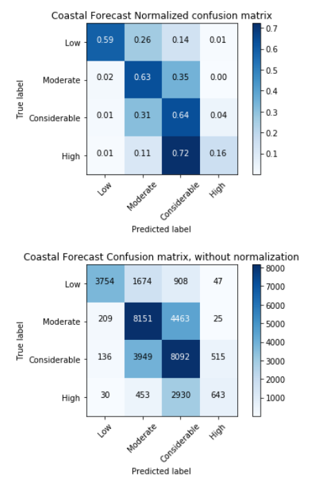
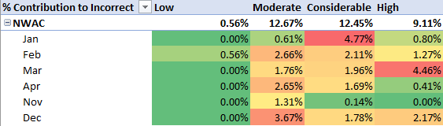
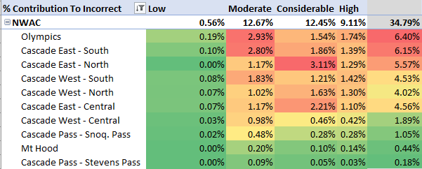
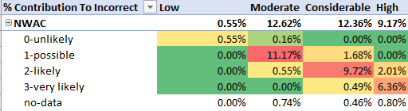
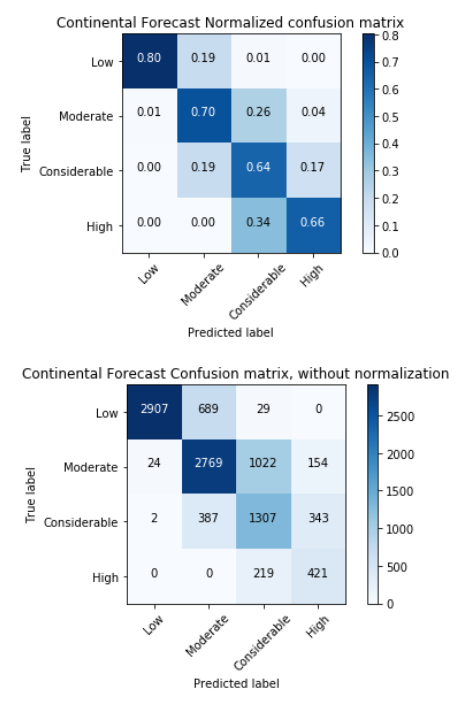
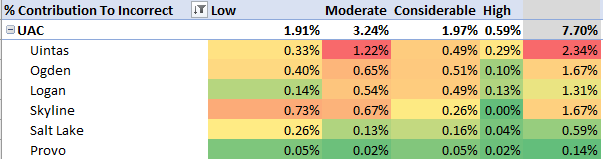
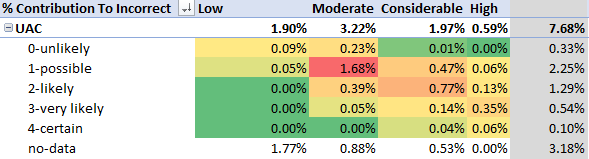

+++
title = '18-19 Season Preview'
date = 2018-12-01T11:48:48-07:00
draft = false 
+++

## Summary

We have fixed several critical issues affecting the inability for the model to generalize and which had a negative impact on last seasons accuracy.  We are also publishing accuracy goals for when experimental forecasts might also be published again and have outlined some analysis of where errors are still affecting the model and what is the plan to address them.

## Looking back on 17-18 Season

Before we look at what are the plans for the coming season I wanted to provide a bit of an update on how we did and what we have learned from last season.  I launched the Open Avalanche Project in early March of 2018 at the tail end of the last Northern Hemisphere Avalanche Season.  While everything was deployed and published as experimental I did want to provide an update on how accurate the forecasts provided were.  The forecasts performed very poorly last season.  The full analysis is available here: [https://github.com/scottcha/OpenAvalancheProject/blob/develop/ML/ForecastAccuracyAnalysis17-18.ipynb](https://github.com/scottcha/OpenAvalancheProject/blob/develop/ML/ForecastAccuracyAnalysis17-18.ipynb) but the net is that measuring both at a regional as well as a single point per region the overall accuracy was less than 30%.  As I investigated there were several critical errors which contributed to this:

1. The train/test split was not done across time and led to model overfitting.
2. The model training pipeline had a few different assumptions about date alignments than the prediction pipeline.
3. I was using 0 as a proxy for missing data incorrectly when it does have meaning in this model.  For example, 0 snow depth does have meaning and isn't a good proxy for missing data.

All of these issues have been examined and will be rectified before other models are published.

That being said there was lots learned in getting the end to end pipeline built and it will be easier for the future to focus less on that and more effort on building the best forecasts possible.

## Looking forward to the 18-19 Season

Over the summer I made a few major updates to the pipeline, resolving the first two issues above (the third will be resolved once new models are published).

I also made the investment to bring in additional data, from Utah Avalanche Center, over the summer greatly expanding the data available to train on but also getting additional regional coverage in a continental climate.

Now that the train/test split is done on a season boundary (currently the training is done from the 13-14 season through the 16-17 season and the 17-18 season is used as the test set) we have accuracy numbers which are better indicators of the real-world model performance.

## When models will be live

The experience and learnings from last year were informative and influenced the position that we should move cautiously in publishing even the experimental forecasts. We want to avoid both people reading in too much to the forecasts as well as we want to build a broad basis of support in the methodology across the public and avalanche forecasting communities.  While we'll continue to make all of our work public but **we will only publish experimental forecasts generated from models with a full season accuracy > 75%**. That number seeks to strike a balance between what is likely useful from moving the conversation forward versus as well as keeping even this experimental work from being misinterpreted or taken out of context.  While we are close to achieving a 75% accuracy on a continental snowpack we still have some work to get there (and the gap is wider for the coastal snowpack).

**Coastal Model Performance**

This basic Random Forest Classifier model struggles to the High forecasts correct a majority of the time and only has an overall accuracy value of 57.3% for the 17-18 test season.  I've attempted more complex models (Xgboost, LSTM DNN) and neither have a significant improvement in accuracy.

Breaking the forecast down across months there was not a clear pattern on parts of the winter which were harder to predict than others.

Breaking down by region did demonstrate the that Olympics did contribute the most to the error.

Across all avalanche problem types the problem types most associated with the model incorrectly predicting the forecast for the Coastal regions are Wind Slabs, followed by Loose Wet and then by Persistent Slab and Cornices.

Errors when Wind Slab is a forecasted avalanche problem:

**Continental Model Performance**

The model has better skill and works across the forecast values better in the coastal region but with an overall accuracy value of 72.1%.

As in the coastal forecast there was not a clear error pattern across dates.

Breaking down by region demonstrates that the Uintas Region is the highest contribution to the error.

As in the Coastal forecast Wind Slabs also are the highest avalanche problem correlated with model error followed by Storm Slab and Persistent Slab.

Errors when Wind Slab is a forecasted avalanche problem:

## Next Steps

1. **Improve wind data:** From the analysis there definitely is a need to examine the wind values going into the forecasting or otherwise determining if it's possible to improve the Wind Slab forecasting.
2. **Get additional data:** Today the model only uses two forecast regions for training and evaluation. We are taking steps to get data from other avalanche centers to help expand the amount of data available to train.
3. **Explore other useful features/models:** While the models are designed to be able to approximate some aspects of snowpack evolution it's not clear how to connect these models with existing state of the art physics models of the snowpack.  We need to investigate this as well as other possible modeling goals (such as predicting avalanche problems).
4. **Continue conversations with the community:** As we learn more about what is possible in the space of automatically generating avalanche forecasts we want to continue the conversation about the appropriate and innovative uses which may be possible.