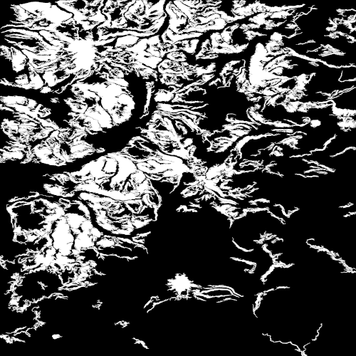
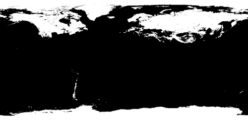
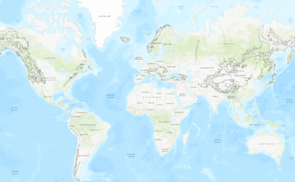

+++
title = "A Global Avalanche Region Map"
date = 2019-06-20T11:48:26-07:00
draft = false
featuredImage = "worldregionsshape_small.png"
+++

## Summary

In order to make the largest impact possible we are starting to refactor the OAP to have a global coverage.  Enabling others around the world to look at data and make contributions will help accelerate our mission to improve the ability to create improved avalanche forecasts and cover more regions which currently aren't covered by human forecasters.  The first building block of this is having a single map (GIS shapefile) to identify which areas of the globe are likely avalanche regions and which aren't.  I'm making that map available today [here].  The rest of this post covers how it was made so others can help contribute to this process.

## Creating The Map

### Identifying Potential Avalanche Regions

There are two attributes we need to be able to identify an avalanche region at scale:
1. A slope
2. The presence of enough snow to avalanche

In order to do this for the entire globe we need two sets of data. The first set of data is elevation data in order to determine slope angles.  For this dataset I used the ASTER digital elevation data [https://asterweb.jpl.nasa.gov/gdem.asp](https://asterweb.jpl.nasa.gov/gdem.asp). Using that dataset you can apply a GIS transform to the data to first determine the slope at a location and subsequently to filter that slope to a range.  The data has a very high resolution but we'll downsample this later to match the resolution which our weather/snow coverage data exists at.

The second data set was to determine snow coverage at peak snow depth of winter.  As part of moving to a global model we are going to start ingesting and forecasting using the 12km global GFS model.  One of the model parameters available in snow depth.  To build this portion of the dataset I merged peak winter snowdepth information for both hemispheres in to a single file.  I used winter 2018 for the southern hemisphere and winter 2019 for the northern.  To make this more accurate it might make sense to merge in a few more years but luckily 2019 was a record snowfall for several locations of the northern hemisphere which helps ensure we are including all potential locations in to our map.

### The GIS Process

To build this map at a global scale was computationally heavy.  To handle that I chose to  prototype the process using QGIS on North America (which I'm most familiar with).  QGIS is largely based on GDAL and I can use those command line tools to then generate a script file which I can run in parallel over the thousands of GEOTiff files which makes up the dataset.  The full script which covers this process is here: [https://github.com/scottcha/OpenAvalancheProject/blob/develop/GetTrainingData/CreateGlobalAvyRegions/ElevationAndSnowToRegion.sh](https://github.com/scottcha/OpenAvalancheProject/blob/develop/GetTrainingData/CreateGlobalAvyRegions/ElevationAndSnowToRegion.sh)

#### Identifying slopes

Using the elevation data we first use gdaldem to derive the slope information and then gdal cals to filter that area to only slopes great than 20 degrees.  Since there are lots of very small slopes which meet this criteria we then wan to use a gdal sieve to remove all the very small slopes and make the first attempt at real regions. At this point we are working with files which look like this (essentially all slopes > 20 degress with any very small slopes removed) which you can see Mt Rainier in the upper left: 

#### Identifying regions

Obviously the specific slope information in the image above is too granular so we want to take a few steps to generalize this.  Using gdalwarp we take each tile and split it in to 8 equally sized pieces (which will match the granularity of our weather and snow data).  For each of those 8 pieces we'll compute the max value to determine if there are slopes in that region or not which meet our criteria.  We can then merge all of these tiles to make a slope map of the world which is the first step to making an avy region map.

Since there are obviously areas of the world with mountains/slopes but which don't get enough snow to cause an avalanche hazard the next step is to merge this slope information with our snowdepth information.  As I mentioned before I pulled the peak snow depth information from the GFS models for both Northern and Southern Hemispheres and merged them to create this mask: 

Using that as a filter for our regions and then doing a bit more cleaning for areas which are either obviously errors in the elevation data or areas I've chosen to optimized out due to the large area but low probability anyone will be there to experience an avalanche (i.e., Greenland) we get the following: 

While I did a bit of manual cleaning I've opted to let the algorithm options leave some unprobable avy regions in the map with the idea that this is an ongoing experiment and it would be interesting to see if there is value in forecasting in these areas (NE United States).  The next steps in this effort will be starting to pull the weather forecasts within these regions and making that data available for people to experiment with.  Also, to improve the usability of the map I've reached out to Greg at peakbagger.com and he's allowed me to to help integrate the mountain range names he has created around the world to create labels for these subshapes: [https://peakbagger.com/RangIndx.aspx](https://peakbagger.com/RangIndx.aspx).  I'll publish an update once that is incorporated.

## Script Location

[https://github.com/scottcha/OpenAvalancheProject/tree/develop/GetTrainingData/CreateGlobalAvyRegions/](https://github.com/scottcha/OpenAvalancheProject/blob/master/GetTrainingData/CreateGlobalAvyRegions/ElevationAndSnowToRegion.sh)

## References

1. [https://www.mtavalanche.com/sites/default/files/MSA_Slope_Angle_Final.pdf](https://www.mtavalanche.com/sites/default/files/MSA_Slope_Angle_Final.pdf)